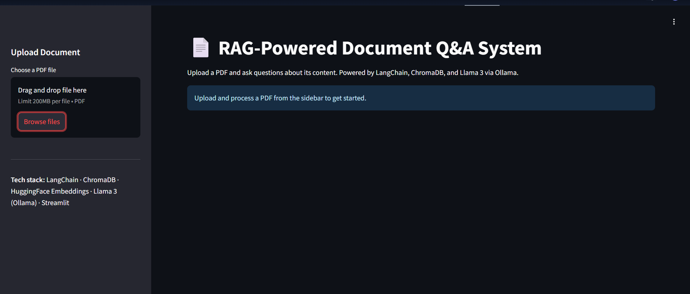
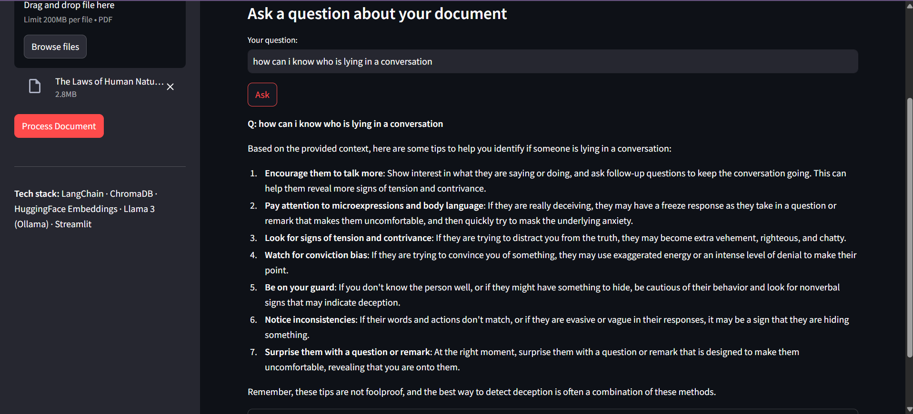

# RAG-Powered Document Q&A System

Upload any PDF and ask natural-language questions about its content, powered by retrieval-augmented generation (RAG).

Live Demo: https://huggingface.co/spaces/aditichoudhury/rag-document-assistant

GitHub Repo: https://github.com/aditichoudhury/rag-document-qa

## Screenshots

### Upload a document

### Ask questions and get grounded answers

## How It Works

1. Upload a PDF document
2. The document is chunked and embedded using HuggingFace sentence-transformers
3. Chunks are stored in a ChromaDB vector store
4. When you ask a question, relevant chunks are retrieved and passed to Llama 3.1 (via Groq) to generate a grounded answer
5. Source chunks are shown alongside the answer for transparency

## Tech Stack

- Framework: LangChain
- Vector Store: ChromaDB
- Embeddings: HuggingFace all-MiniLM-L6-v2 (local)
- LLM: Groq API (llama-3.1-8b-instant)
- UI: Streamlit
- Deployment: Hugging Face Spaces

## Run Locally

git clone https://github.com/aditichoudhury/rag-document-qa.git
cd rag-document-qa
pip install -r requirements.txt
streamlit run app.py

You'll need a GROQ_API_KEY in a .env file. Get one free at console.groq.com/keys

## License

This project is licensed under the MIT License - see the [LICENSE](LICENSE) file for details.
